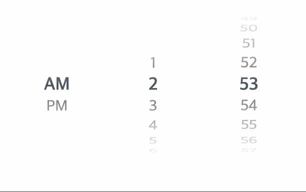
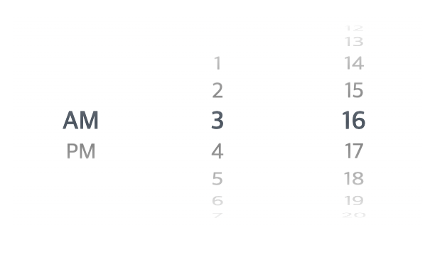
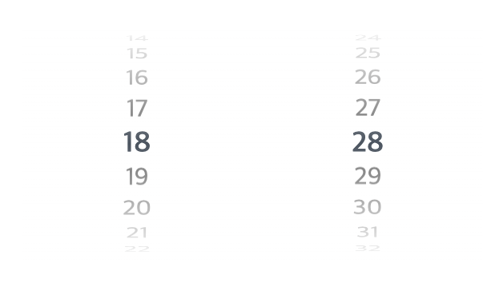

[](https://www.npmjs.com/package/react-ios-style-time-picker)

# React iOS Style Time Picker



A lightweight, customizable **iOS-style rolling wheel time picker** component for your next **React** app — supports 12/24-hour format, infinite scroll, and multiple locales.

## Demo

Check out the live demo here: [Live Demo](https://eric-hjh.github.io/react-ios-style-time-picker/?path=/story/timepicker--default)

## install

```
npm i react-ios-style-time-picker
```

## Usage

### 12 hours format



```tsx
import { useState } from 'react';
import { TimePicker } from 'react-ios-style-time-picker';
import 'react-ios-style-time-picker/style.css';

function App() {
  const [time, setTime] = useState<{ hour: number; minute: number }>({
    hour: new Date().getHours(),
    minute: new Date().getMinutes(),
  });

  const handleTimeChange = (hour: number, minute: number) => {
    setTime({ hour, minute });
  };

  return (
    <div>
      <TimePicker onChange={handleTimeChange} hourFormat='12' />
    </div>
  );
}
```

### 24 hours format



```tsx
import { useState } from 'react';
import { TimePicker } from 'react-ios-style-time-picker';
import 'react-ios-style-time-picker/style.css';

function App() {
  const [time, setTime] = useState<{ hour: number; minute: number }>({
    hour: new Date().getHours(),
    minute: new Date().getMinutes(),
  });

  const handleTimeChange = (hour: number, minute: number) => {
    setTime({ hour, minute });
  };

  return (
    <div>
      <TimePicker onChange={handleTimeChange} hourFormat='24' />
    </div>
  );
}
```

## Props

| Prop         | Type                                     | Required | Default      | Description                                                        |
| :----------- | :--------------------------------------- | :------- | :----------- | :----------------------------------------------------------------- |
| `onChange`   | `(hour: number, minute: number) => void` | ✅       | -            | Callback invoked when the selected time changes                    |
| `initTime`   | `Date`                                   | ❌       | `new Date()` | Sets the initial time                                              |
| `infinite`   | `boolean`                                | ❌       | `false`      | Enables infinite scroll style                                      |
| `className`  | `string`                                 | ❌       | `undefined`  | Custom class name for styling                                      |
| `hourFormat` | `'12'` \| `'24'`                         | ❌       | `'12'`       | Time format (12-hour/24-hour)                                      |
| `locale`     | `'en'` \| `'ko'` \| `'ja'` \| `'zh'`     | ❌       | `'en'`       | Language for displaying AM/PM (English, Korean, Japanese, Chinese) |

## Time Format (`hourFormat`)

- `12`: Displays AM/PM notation
- `24`: Displays 0-23 hour format

## Get involved!

We appreciate your feedback and contributions. If you have feature requests, questions, or want to contribute code or config files, please don't hesitate to use the GitHub Issue tracker.

We welcome all individual contributors, regardless of their level of experience or skill set. Your contributions are valuable, and we are excited to see what you can accomplish in this collaborative and supportive environment.

## Reference

Inspired by [ios-style-picker](https://www.npmjs.com/package/ios-style-picker?activeTab=readme)

It's forked from [this gist](https://gist.github.com/wjpeters/876a8fe4040a2bb4b4eb28d2270620a5)

## License

The MIT License.
